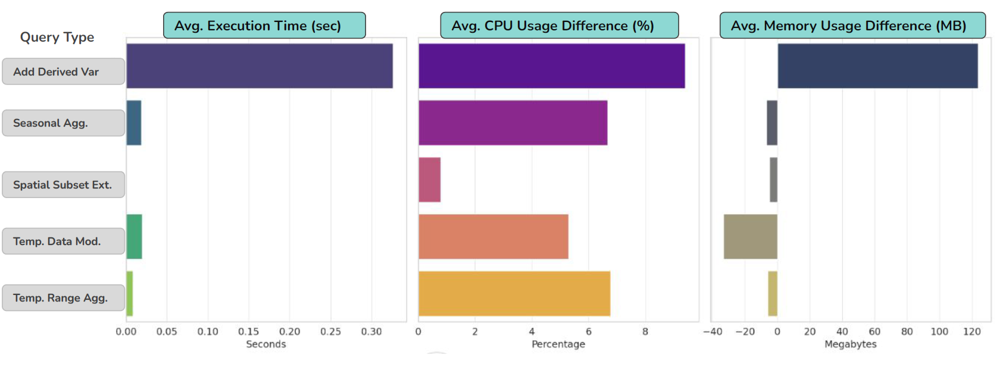

# Benchmarking Raster Data (with ERA5)

This repository contains a benchmarking framework for evaluating the performance of raster data processing systems, with a focus on climate data analysis using ERA5 climate reanalysis data.

## Description

The benchmarking system performs extensive data processing tasks to assess various data processing systems. It emphasizes on operations like aggregation and modification of temporal and spatial climate data, aiming to fill the gaps in current benchmarking approaches.

## Getting started

### Dependencies

- Python 3.8+
- xarray, numpy, pandas, matplotlib (See `requirements.txt` for a complete list)

### Installation

Clone the repository using:

```bash
git clone https://github.com/proteeti13/Benchmarking-Raster-Data.git

```

Install the required packages:

```bash
pip install -r requirements.txt
```

### Executing the Benchmark
Generate the workload by running:

```bash
python workload_generation.py
```
Execute the benchmarking process:

```bash
python workload_execution.py
```

## File Descriptions

- **_query_functions.py_** : Defines query functions to process climate data.
- **_workload_generation.py_** : Generates a set of queries for the benchmark based on the defined parameters. Results stored in **_workload.csv_**.
- **_workload_execution.py_** : Executes the generated queries and records performance metrics.
- **_benchmark_config.json_** : Configuration file setting the benchmark parameters.
- **_benchmark_results.csv_** : Output file capturing the benchmark results.
- **_era5_queries.ipynb_** : Extracting the dataset through CDS Api & dataset exploration.


## Results

The benchmark results illustrate system performance across a variety of query types. Find a summary and detailed analysis in benchmark_results.csv.



*Visual Results for Evaluation*

## Contributing
If interested, fork the repository, make the improvements, and submit a pull request.

## Author
Proteeti Prova Rawshan \
Research in Computer & Systems Engineering\
proteeti-prova.rawshan@tu-ilmenau.de / proteeti13@gmail.com\
Technische Universität Ilmenau

## Acknowledgment
Dr. Marcus Paradies\
PostDoc Researcher\
Department of Databases and Information Systems\
Technische Universität Ilmenau 
